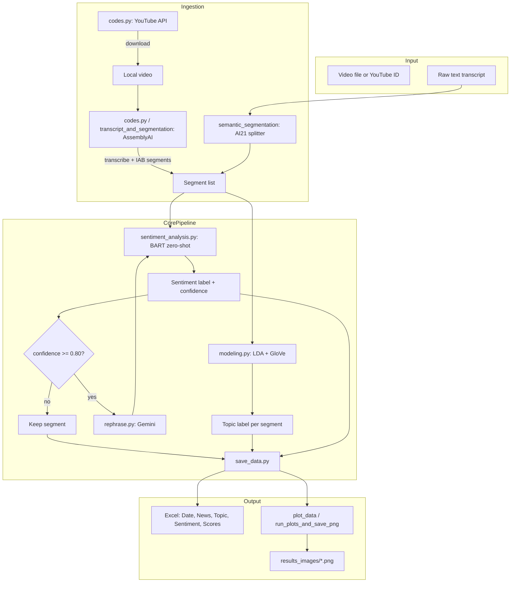
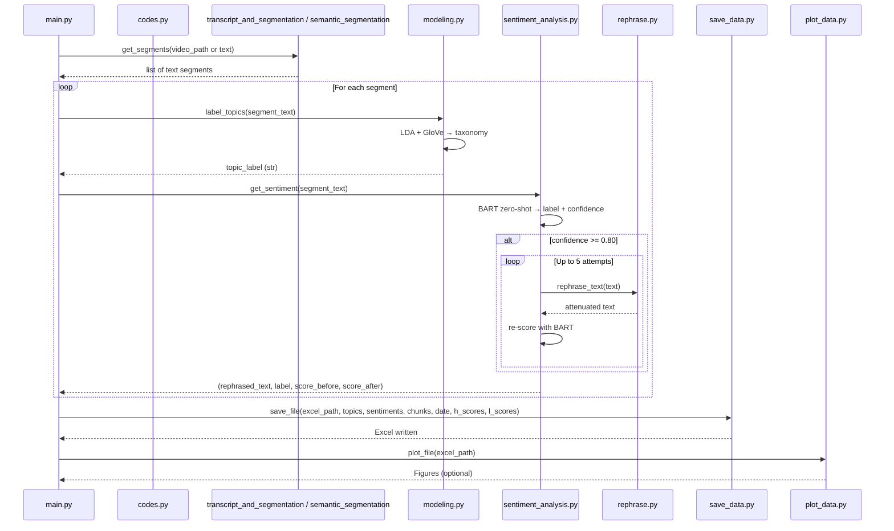

# Emotion-Aware Broadcast News Analytics

Technical repository for the **Emotion-Aware Broadcast News Analytics** pipeline: segment-level topic modeling, sentiment intensity scaling, and semantic-preserving regulation. Intended for **developers and reviewers** who need to run, audit, or extend the code.

---

## Table of contents

- [Tech stack](#tech-stack)
- [System architecture](#system-architecture)
- [Pipeline flowchart](#pipeline-flowchart)
- [Repository layout](#repository-layout)
- [Requirements](#requirements)
- [Setup](#setup)
- [Run instructions](#run-instructions)
- [Module I/O reference](#module-io-reference)
- [Configuration](#configuration)
- [Result images](#result-images)
- [Troubleshooting](#troubleshooting)
- [Citation](#citation)

---

## Tech stack

| Layer | Technology |
|-------|------------|
| **Language** | Python 3.10+ |
| **Video / ingestion** | YouTube Data API v3, `pytubefix`, `yt-dlp` |
| **Transcription** | AssemblyAI (cloud API) |
| **Segmentation** | AssemblyAI IAB categories **or** AI21 Semantic Text Splitter |
| **Topic modeling** | Gensim LDA, GloVe embeddings (100d), spaCy `en_core_web_sm` |
| **Sentiment** | Hugging Face Transformers — `facebook/bart-large-mnli` (zero-shot) |
| **Rephrasing** | Google Generative AI (Gemini) |
| **Data export** | pandas → Excel (`.xlsx`), matplotlib for figures |

---

## System architecture



---

## Pipeline flowchart

End-to-end flow for a single run (e.g. `python main.py`):



---

## Repository layout

| Path | Role | Input | Output |
|------|------|--------|--------|
| `main.py` | Entry point; orchestrates pipeline | Video path or segment list | Excel + console |
| `codes.py` | YouTube search/download, AssemblyAI transcribe | Query or video ID, file path | Video path, full transcript text |
| `transcript_and_segmentation.py` | Transcribe + IAB segment (video in) | Video path | `list[str]` segments |
| `semantic_segmentation.py` | Text-only semantic split | Raw text | `list[str]` segments |
| `modeling.py` | LDA + GloVe → topic taxonomy label | Segment text | Single topic label (str) |
| `sentiment_analysis.py` | BART sentiment + iterative rephrasing | Segment text | (rephrased_text, label, score_before, score_after) |
| `rephrase.py` | Attenuate emotional intensity (Gemini) | Text | Rephrased text |
| `save_data.py` | Append results to Excel | Lists: topics, sentiments, chunks, dates, scores | `.xlsx` file |
| `plot_data.py` | Build dataset summary / paper figures | Excel path | Matplotlib figures (save to disk) |
| `run_plots_and_save_png.py` | Batch (re)generate figures from Excel | Excel path / config | PNGs (e.g. in `results_images/`) |
| `generate_organic_dataset.py` | Synthetic data for tests | — | Synthetic Excel/dataset |
| `results_images/` | Numbered result figures | — | `figure1.png`, `figure2.png`, … |
| `docs/` | Architecture / flowchart images | — | Optional `pipeline_flowchart.png`, `architecture.png` |
| `requirements.txt` | Python dependencies | — | — |
| `.env.example` | Env var template for API keys | — | Copy to `.env` |

---

## Requirements

- **Python** 3.10 or higher  
- **GPU** optional but recommended for BART inference  
- **API keys**: YouTube, AssemblyAI, Google Generative AI; AI21 only if using `semantic_segmentation.py`  
- **GloVe file** for `modeling.py`: set path in code (e.g. `glove.6B.100d.txt`)

---

## Setup

1. **Clone and enter repo**
   ```bash
   git clone https://github.com/tayyabrehman96/Emotion-Aware-Broadcast-News-Analytics-.git
   cd Emotion-Aware-Broadcast-News-Analytics-
   ```

2. **Virtual environment**
   ```bash
   python -m venv .venv
   .venv\Scripts\activate          # Windows
   # source .venv/bin/activate     # Linux/macOS
   ```

3. **Install dependencies**
   ```bash
   pip install -r requirements.txt
   python -m spacy download en_core_web_sm
   ```

4. **API keys and config**
   - Copy `.env.example` to `.env`.
   - Fill in: `YOUTUBE_API_KEY`, `ASSEMBLYAI_API_KEY`, `GOOGLE_GENERATIVE_AI_API_KEY`, and optionally `AI21_API_KEY`.
   - **In code**: `main.py`, `codes.py`, `rephrase.py`, `transcript_and_segmentation.py`, `semantic_segmentation.py` currently read keys from script variables; switch to `os.getenv(...)` for production.

5. **GloVe (for topic modeling)**
   - Download GloVe 6B 100d (or match the path in `modeling.py`).
   - Set `glove_file_path` in `modeling.py` to your local path.

6. **Paths in `main.py`**
   - Set `video_file_path` to your input video (or uncomment YouTube search/download and set `excel_file_path`).

---

## Run instructions

### Full pipeline (one command)

```bash
python main.py
```

- **Input**: Video path set in `main.py` (or use the commented YouTube flow to download first).
- **Output**: Excel file at `excel_file_path` (see line ~113 in `main.py`) and any plots from `plot_file(excel_file_path)`.

### Step-by-step (for review or debugging)

1. **Get segments from a video**
   - Use `transcript_and_segmentation.py`: `get_segments(video_file_path)` returns `list[str]`.
   - Or: transcribe with `codes.VideoTranscribe(path)` then split with `semantic_segmentation.get_segments(transcript_text)` if using AI21.

2. **Topic per segment**
   ```python
   from modeling import label_topics
   topic = label_topics(segment_text)  # str
   ```

3. **Sentiment + optional rephrasing**
   ```python
   from sentiment_analysis import get_sentiment
   rephrased, label, score_before, score_after = get_sentiment(segment_text)
   ```

4. **Export**
   ```python
   from save_data import save_file
   save_file(excel_path, topics, sentiments, chunks, date, h_scores, l_scores)
   ```

5. **Regenerate figures**
   ```bash
   python run_plots_and_save_png.py
   ```
   Save outputs as `figure1.png`, `figure2.png`, … in `results_images/` to track in the repo.

---

## Module I/O reference

| Module | Function | Input | Output |
|--------|----------|--------|--------|
| `codes` | `search_videos(query, max_results=5)` | Query string | Selected video dict (snippet, id) |
| `codes` | `download_video(video_id, output_path)` | YouTube video ID, path | Local video file path |
| `codes` | `VideoTranscribe(path)` | Audio/video path | Full transcript string |
| `transcript_and_segmentation` | `get_segments(video_file)` | Video path | `list[str]` (IAB segments) |
| `semantic_segmentation` | `get_segments(text)` | Raw text | `list[str]` (semantic chunks) |
| `modeling` | `label_topics(text)` | Segment text | Single topic label (str) |
| `sentiment_analysis` | `get_sentiment(text)` | Segment text | `(rephrased_text, label, score_before, score_after)` |
| `rephrase` | `rephrase_text(text)` | Text | Rephrased text (string) |
| `save_data` | `save_file(excel_path, topics, sentiments, chunks, pdate, h_score, l_score)` | Path + 6 lists | Appends rows to Excel |
| `plot_data` | `plot_file(excel_path)` | Excel path | Writes figures to disk |

---

## Configuration

| Item | Where | Default / note |
|------|--------|------------------|
| Sentiment threshold | `sentiment_analysis.py` | `0.80` (rephrase if confidence ≥ 80%) |
| Max rephrasing attempts | `sentiment_analysis.py` | `5` |
| BART model | `sentiment_analysis.py` | `facebook/bart-large-mnli` |
| Topic taxonomy | `modeling.py` | In-code list (Politics, Business, War, …) |
| GloVe path | `modeling.py` | Set `glove_file_path` to your file |
| Excel output path | `main.py` | Set `excel_file_path` |
| Video input path | `main.py` | Set `video_file_path` or use YouTube flow |

---

## Result images

- **Location**: `results_images/`
- **Naming**: `figure1.png`, `figure2.png`, … (see `results_images/README.md`).
- **How to add**: Run `run_plots_and_save_png.py`, then copy the generated PNGs into `results_images/` and commit. Only `results_images/*.png` and `*.jpg` are tracked; other image outputs stay gitignored.

---

## Troubleshooting

| Issue | Check |
|-------|--------|
| `ModuleNotFoundError` | Activate venv, run `pip install -r requirements.txt`, and `python -m spacy download en_core_web_sm`. |
| API errors (YouTube, AssemblyAI, Google, AI21) | Keys in code or `.env`; quotas and network. |
| GloVe file not found | Update `glove_file_path` in `modeling.py` to your `glove.6B.100d.txt` path. |
| Excel path error | Create parent dir for `excel_file_path` or set a path where you have write access. |
| BART / CUDA OOM | Reduce batch size or run on CPU (slower). |
| Segments empty | For video: ensure AssemblyAI supports the format; for text: check AI21 key and input encoding. |

---

## Citation

```bibtex
@article{emotion-aware-news-analytics,
  title={Emotion-Aware Broadcast News Analytics: An Integrated Deep Learning Pipeline for Topic Extraction, Sentiment Intensity Scaling, and Semantic-Preserving Regulation},
  author={Rehman, Tayyab and Mustafa, Muzzamil},
  journal={Knowledge-Based Systems},
  year={2025},
  note={Submitted}
}
```

---

## License and data

Code is for research and review. Use of YouTube, AssemblyAI, Google, and AI21 APIs is subject to their terms. You are responsible for data and API usage and for complying with applicable ethics and data-protection policies.
